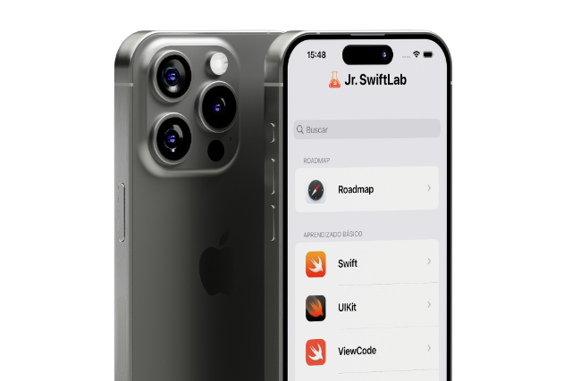

# Jr. SwiftLab

The app that will help you, Junior iOS Developer, pass any interview.

All of Jr. SwiftLab's content is subdivided into well-defined sections, with icons corresponding to the articles and framworks, as well as a dynamic search bar so you can easily find what you need.

## Table of Contents

- [Features](#features)
- [Hotsite](#hotsite)
- [Getting Started](#getting-started)
- [Technologies](#technologies)
- [Author](#author)

## Features

- **Made in SwiftUI**: A modern, responsive app made entirely in SwiftUI that lets you study on both your iPhone and iPad.

- **Experience**: Jr. SwiftLab's design is totally focused on making your learning experience pleasant, intuitive and objective. Its content is always up-to-date with the latest Swift technologies.

- **Dark Mode**: I haven't forgotten about you, Dev vampire, who's always running away from the light 🧛‍♂️.

## Hotsite

[Jr. SwiftLab Homepage](https://link-url-here.org)

## Technologies

- Swift
- SwiftUI
- Combine
- CoreData

## Author

  

Made with ♥️ por André Porto 🚀

 

